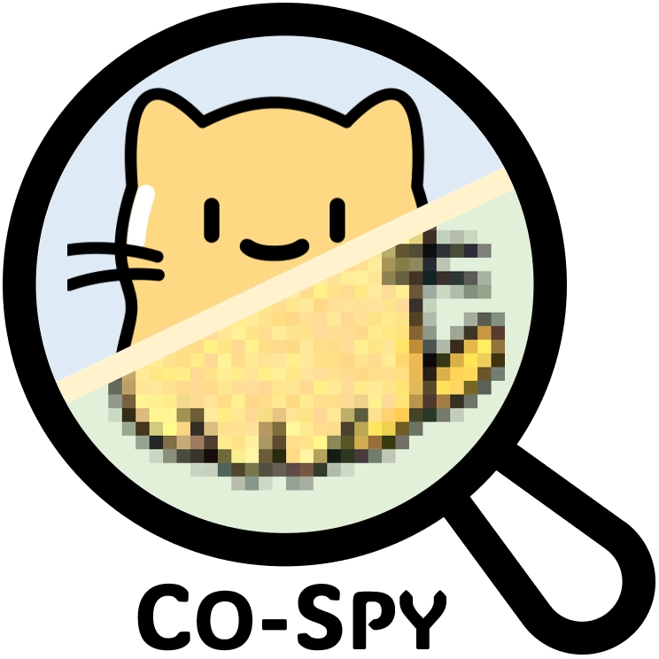
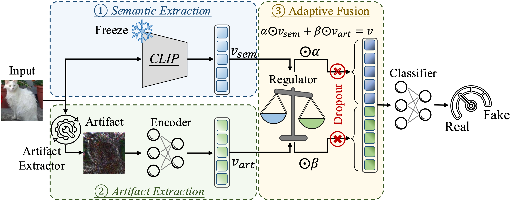

<div align="center">
    
</div>

# CO-SPY: Combining Semantic and Pixel Features to Detect Synthetic Images by AI


Table of Contents
=================
- [Table of Contents](#table-of-contents)
  - [Overview](#overview)
  - [Main Code Architecutre](#main-code-architecture)
  - [Environments](#environments)
  - [Prerequisites](#prerequisites)
  - [CO-SPY-Bench](#co-spy-bench)
  - [Experiments](#experiments)
    - [Evaluation](#evaluation)
    - [Training](#training)
    - [Best Practice](#best-practice)
  - [Citation](#citation)
  - [Acknowledgement](#acknowledgement)

## Overview
- This is the official implementation for CVPR 2025 paper "[CO-SPY: Combining Semantic and Pixel Features to Detect Synthetic Images by AI](https://openaccess.thecvf.com/content/CVPR2025/html/Cheng_CO-SPY_Combining_Semantic_and_Pixel_Features_to_Detect_Synthetic_Images_CVPR_2025_paper.html)".
- [[arXiv](https://arxiv.org/abs/2503.18286)\] | \[[poster](https://www.cs.purdue.edu/homes/cheng535/static/slides/COSPY_poster.pdf)\]



## Main Code Architecture
    .
    ├── data              # Dataset folder
    │   ├── in_the_wild   # CO-SPY-Bench in-the-wild synthetic samples
    │   ├── test          # CO-SPY-Bench synthetic samples
    │   └── train         # Training dataset
    ├── Datasets          # Various dataset classes
    ├── Detectors         # Various detector classes
    ├── pretrained        # Pre-trained weights
    ├── main.py           # Main function
    ├── evaluate.py       # Evaluation function
    ├── train.py          # Training function
    └── utils.py          # Utility functions

## Environments
```bash
# Create python environment (optional)
conda env create -f environment.yml
source activate cospy
```

## Prerequisites
To download the pre-trained detector weights from Google Drive, see [`pretrained/README.md`](https://github.com/Megum1/CO-SPY/blob/main/pretrained/README.md).

For instructions on downloading the test datasets, refer to [data/test/README.md](https://github.com/Megum1/CO-SPY/blob/main/data/test/README.md) and [data/test/README.md](https://github.com/Megum1/CO-SPY/blob/main/data/in_the_wild/README.md).

```bash
# Download the training dataset
cd data/train
sh download.sh
```


## CO-SPY-Bench
We have released our benchmark on [Huggingface](https://huggingface.co/datasets/ruojiruoli/Co-Spy-Bench), designed to offer diverse and comprehensive coverage of the latest generative models:
- Captions are sourced from five real-world datasets: MSCOCO2017, CC3M, Flickr, TextCaps, and SBU.
- Synthetic images are generated using 22 different models, covering a wide range of architectures.
- Diverse generation parameters, such as diffusion steps and guidance scales, are used to enrich variability.


## Experiments  
We provide a sample detector trained on **DRCT-2M/SD-v1.4**, along with code snippets for training and evaluation.

### Evaluation
To evaluate the pre-trained detector on **CO-SPY-Bench**, run
```bash
python evaluate.py --gpu 0 --phase test --save_dir test_results
```
Evaluation results will be saved to `./test_results`.
This includes:
- `output.json`: predicted synthetic probabilities for each sample.
- `result.json`: evaluation metrics (AP and accuracy) for each test source.

To run inference on a single image:
```bash
python evaluate --gpu 1 --phase scan
# The script will prompt for the image file path:
# "Please enter the image filepath for scanning: "
imgs/test.png
# Output (probability - decision):
# "CO-SPY Prediction: 0.854 - AI-Generated"
```

### Training
To train an example detector:
```bash
# Train for 10 epochs
python train.py --gpu 2 --phase train --ckpt ckpt --epochs 10
```
The trained model will be saved to `./ckpt/cospy`.


### Best Practice
While `train.py` offers a streamlined training pipeline, we recommend training the semantic and artifact components separately, followed by combining and calibrating them:
```bash
# Train the semantic component
python train_single --gpu 3 --phase train --detector semantic

# Train the artifact component
python train_single --gpu 4 --phase train --detector artifact

# Combine and calibrate the final detector
python calibrate_combine.py --gpu 5 --phase train
```
The default saving directory is `./ckpt`, and you will find `./ckpt/artifact`, `./ckpt/semantic`, and `./ckpt/cospy_calibrate` after training.
Simply change `--phase train` to `--phase test` if you want to evaluate the performance of either component or the combined detector.


## Citation
Please cite our paper if you find it useful for your research.😀

```bibtex
@inproceedings{cheng2025co,
  title={CO-SPY: Combining Semantic and Pixel Features to Detect Synthetic Images by AI},
  author={Cheng, Siyuan and Lyu, Lingjuan and Wang, Zhenting and Zhang, Xiangyu and Sehwag, Vikash},
  booktitle={Proceedings of the Computer Vision and Pattern Recognition Conference},
  pages={13455--13465},
  year={2025}
}
```

## Acknowledgement
We gratefully acknowledge these outstanding works, which have deeply inspired our project!
- [CNNDetection](https://github.com/PeterWang512/CNNDetection)
- [UniversalFakeDetect](https://github.com/WisconsinAIVision/UniversalFakeDetect)
- [NPR-DeepfakeDetection](https://github.com/chuangchuangtan/NPR-DeepfakeDetection)
- [DRCT](https://github.com/beibuwandeluori/DRCT)
